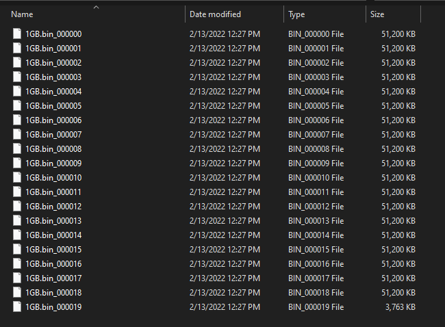
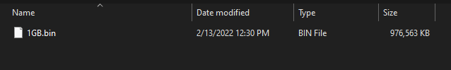

# multi-transfer

The multi-transfer project has four main goals:
1. Ease the transferring of files from high security enviornments.
1. Work the same on different OS types such as Windows, Linux, and MacOS.
1. Allow transferring of files from and to different types of sources and destinations.
1. Allow file transfers to happen in parrallel to speed up transfers.

There are many applications that provide file transfer for single types of destinations such as SFTP, AWS CLI, Azure CLI, JFrog CLI, etc. While these are all perfectly usable applications they generally only allow transfering to a single endpoint type, such as S3 or Blob storage. They can also be problematic to use in higher security environments where you likely don't have permissions to install them or run unknown executable files. Getting permission is often a lenghty process and usually requires time from an already very busy System Admin. This can cause project delays from what should have been a simple copy operation.

To meet its goals multi-transfer is built with the following in mind:
* multi-transfer is built to run on Java 8 at a minimum. Java is usually installed on most systems whether they are high security or not and users are generally permitted to execute JAR files. Java is also supported on multiple OS types due to the use of its [JVM](https://en.wikipedia.org/wiki/Java_virtual_machine).
* multi-transfer has an interface infrastructure that allows easily adding new source and destination types.
* multi-transfer is built using Kotlin's [Coroutines](https://kotlinlang.org/docs/coroutines-overview.html) to easily allow parallel transfers without creating large numbers of threads.

# Execution

multi-transfer.jar is a fat jar. This means all of its dependencies are inside the jar to begin with so there is nothing else the program needs to depend on.

To run the jar all that is need is needed is to do:

```bash
java -jar ./multi-transfer.jar
```

To get the command line help run the following:

```bash
java -jar ./multi-transfer.jar --help
```

To get the application version run the following:

```bash
java -jar ./multi-transfer.jar --version
```

# Commands

multi-transfer has 3 basic commands that it can perform.

* split: Seperate a file into smaller parts.
* combine: Put a split file back together.
* transfer: Transfer a file from a source to destination.

## Splitting and Combining

The split and combine commands are not necessary for transfering files, however they come in handy when working in low bandwidth environments or networks doing deep packet scans where large transfers may time out before they finish. By splitting up the files into smaller parts and combining them on the other side, larger files can be transfered. 

### Split

The split command will split a file up into small files called chunks. The split is done at the binary level and as such the command does not care what the file contents are.

The size of each chunk file will can be controlled with the --size option. Each chunk will be at most the provided size. The last chunk will likely be smaller, containing the remaining content.

The chunk will be named the same as the source file with a _###### number on the end. This is to maintain an alphabetical order to the file names so that combine will know what order to put them back together in.

#### Options

split has the following command line options.
* -d, --delete-original: Optional. Deletes source file after a successful split. Defaults to off.
* -s, --size: Optional. The maximum size of each chunk. The format is in \<numeric size\>B|KB|MB|GB|TB. Defaults to 100MB. 
* path: Required. The path to the file to be split up.

#### Example

Lets say you are splitting a 1 GB file called 1GB.bin into 50 MB chunks. Once the splitting is finished you want the 1GB.bin file deleted. The command to do so is:

```bash
java -jar ./multi-transfer.jar split --delete-original --size 50MB 1GB.bin
```

This creates 20 chunk files like in the picture below:



### Combine

The combine command will take the files created by split and combine them back into a single file. It will combine any series of files as long the file names are in alphabetical order.

#### Options

* -d, --delete-chunk: Optional. Deletes a chunk file after it has been added to the combined file.
* destinationName: Required. The name of the file to combine the chunks into.
* paths: Required. The chunk file to be combined. You can use the terminal glob operators to help build the list. No matter how the files are added to the list, they will be put into alphabetical order before combining.

#### Example

Lets say you want to combine the 20 50 GB chunk files created in the split example into back into 1GB.bin, and delete the chunk files as they are combined in. The command to do so is:

```bash
java -jar ./multi-transfer.jar combine --delete-chunk 1GB.bin 1GB.bin_*
```

This removes the 20 chunks files and you are left with the 1GB.bin file as it was before the split.



## Transfer

Transfer uses prebuilt source and destionation sub commands to transfer files from a source to a destionation. Transfers use buffers transfer files in chunks when possible so as not to consume too much memory. Transfers also attempt to use non-blocking IO when possible so as to prevent thread locking.

### Options

* -p, --parallelism: Optional. Default 1. How many transfers to run in parallel. 
* --insecure: Optional. When set multi-transfer will ignore the authenticity of any SSL certs and assume they are genuine. Transfers are still encrypted in transit even though the source or destination is not verified. This should only be used when you are confident of the endpoint you are connecting to.
* --trust-store: Optional. Points to a Java Keystore with trusted certificates that multi-transfer should use in place of the default default certificates installed with Java.
* --trust-store-password: Required if --trust-store is set. The password to the trust store defined in --trust-store.

### File

The file subcommand type is responsible for 

#### file-src

#### file-dest


### Artifactory

Transfer from/to a [JFrog Artifactory](https://jfrog.com/artifactory/) system. 